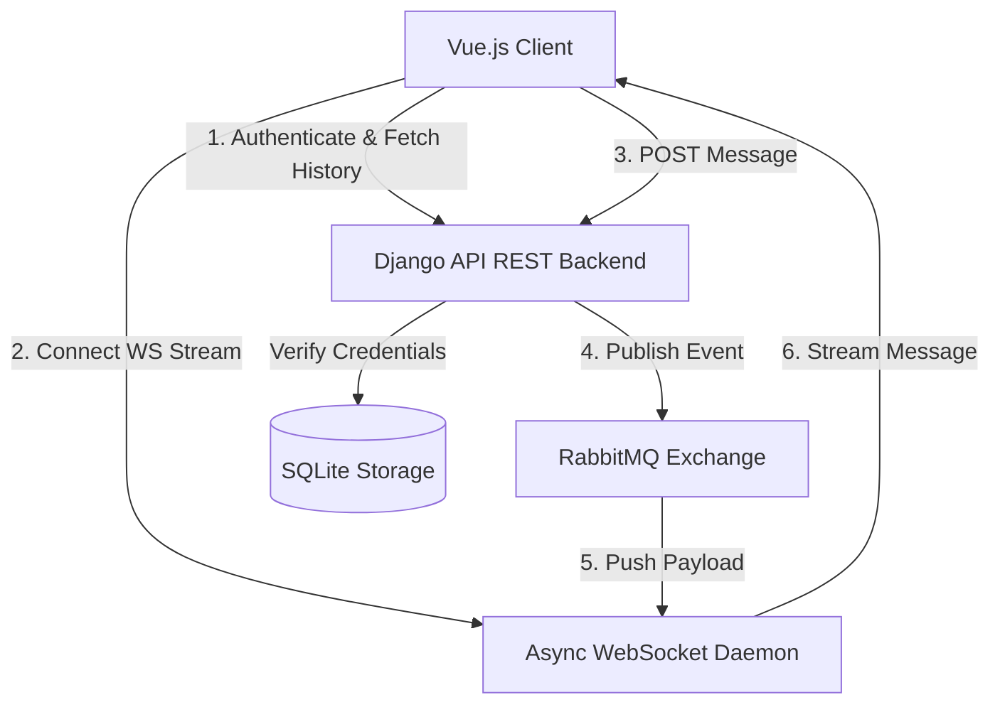

# 🌌 CHATIRE

> Next-generation, real-time decentralized-feeling messaging architecture built on a high-throughput reactive event loop

[](https://djangoproject.com)
[](https://vuejs.org)
[](https://www.rabbitmq.com)
[](https://jwt.io)

---

## ⚡ The Vision

**Chatire** is a secure, reactive, and visually stunning real-time chat ecosystem designed for high-concurrency communications. By separating the HTTP request-response cycle from the stateful real-time message broadcasting layer, Chatire delivers instant message distribution and premium security standards.

---

## 🚀 Key Features

*   **🔒 Hardened JWT Engine**: Utilizes short-lived access tokens with rotating refresh tokens. The refresh path is obfuscated behind an ambiguous endpoint (`/this/is/hard/to/find/`) to thwart automated vulnerability scanners.
*   **📡 Async Event Multiplexing**: Real-time communication is decoupled from the web app using a custom **Python + Gevent + WebSockets** pipeline interacting directly with a **RabbitMQ** event exchange.
*   **✨ Premium Reactive Frontend**: A sleek, minimal, and fully interactive Vue.js user interface with micro-animations, dynamic loading transitions, and real-time state management.
*   **🔄 Silent Token Rotation**: Automatic, background authentication handshakes keep users authenticated without blocking the interface or causing session expiration interruption.

---

## Key Innovations

*   **🔒 Obfuscated Security Perimeter**: Uses standard JWT lifecycles but paths the token rotation behind an ambiguous router segment (`/this/is/hard/to/find/`) to disrupt automated credential scanners.
*   **📡 Dual-Channel Synchronization (Failsafe Fallback)**: If a network barrier or firewall closes the WebSocket port (`wss://`), the client instantly and silently transitions to **Adaptive HTTP Polling** (every 3s) to prevent any chat interruption.
*   **🔄 Pure Non-Blocking Core**: Stripped of conflicting monkey-patch systems (like legacy gevent overrides) to allow Python's native `asyncio` event loop to execute at maximum throughput.
  
---
## 🏗 System Architecture



---

## 🛠 Tech Stack

| Layer | Technology | Role |
| :--- | :--- | :--- |
| **Frontend** | Vue.js (v2), Vue Router, Webpack | Client UI, State Management, Silent Handshakes |
| **Primary Backend**| Django 6.0, Django REST Framework | User Authentication, HTTP REST Endpoints, DB Management |
| **Auth Provider** | Djoser + SimpleJWT | Strict JWT Lifecycles & Encryption |
| **Message Broker** | RabbitMQ | High-performance Pub/Sub Event Exchange |
| **Socket Daemon** | Python asyncio + websockets + gevent | Stateless Real-time Push Delivery |
| **Database** | SQLite3 | Relational Data Store |

---

## 🚦 Getting Started

### Prerequisites
Make sure you have the following installed:
*   [Python 3.10+](https://python.org)
*   [Node.js](https://nodejs.org)
*   [RabbitMQ Server](https://www.rabbitmq.com/download.html)

---

### Backend Installation & Configuration

1. Clone the repository and navigate to the project directory:
    ```bash
    git clone https://github.com/ankanz1/Chatire.git
    cd Chatire
    ```
2. Activate the virtual environment and install dependencies:
    ```bash
    .venv\Scripts\activate
    pip install -r requirements.txt
    ```
3. Run database migrations:
    ```bash
    cd chatire
    python manage.py migrate
    ```
4. Start the Django application server (bind to `0.0.0.0` to allow other devices to connect):
    ```bash
    python manage.py runserver 0.0.0.0:8000
    ```

---

### Real-Time Event Daemon Setup

1. Start your local **RabbitMQ** server instance.
2. In a new terminal (with active virtual environment), launch the WebSocket server:
    ```bash
    python websocket.py
    ```
    *The server will bind and listen on `ws://0.0.0.0:8081` (accessible on the local network).*

---

### Frontend Installation & Configuration

1. Navigate to the frontend directory:
    ```bash
    cd chatire-frontend
    ```
2. Install npm modules:
    ```bash
    npm install
    ```
3. Start the Webpack development server:
    ```bash
    npm run dev
    ```
    *Open [http://localhost:8080](http://localhost:8080) to access the application.*

---
## Working Demo:

In Same Device:


Between Two Different Device:


---

## 🔮 Futuristic Roadmap
- [ ] Matrix Network Protocol Integration: Allow cross-server federated chatting utilizing Matrix room protocols.
- [ ] End-to-End Encryption (E2EE): Implementation of the Double Ratchet cryptographic algorithm directly in-browser using Web Crypto APIs.
- [ ] Local-First Synchronization: Cache messages locally using IndexedDB, syncing changes automatically once internet connectivity is restored.
- [ ] Zero-Knowledge User Verification: Logins authenticated purely via secure cryptographic key exchanges—eliminating database-side passwords.

---

🌌 *Developed for the future of interactive messaging.*
